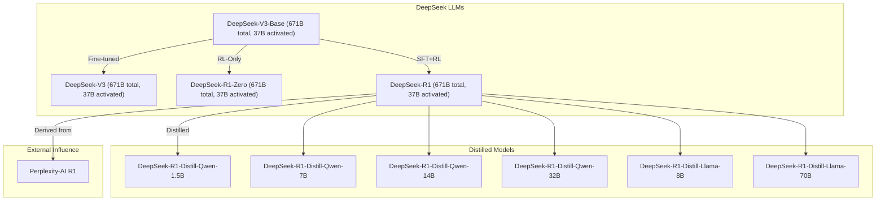
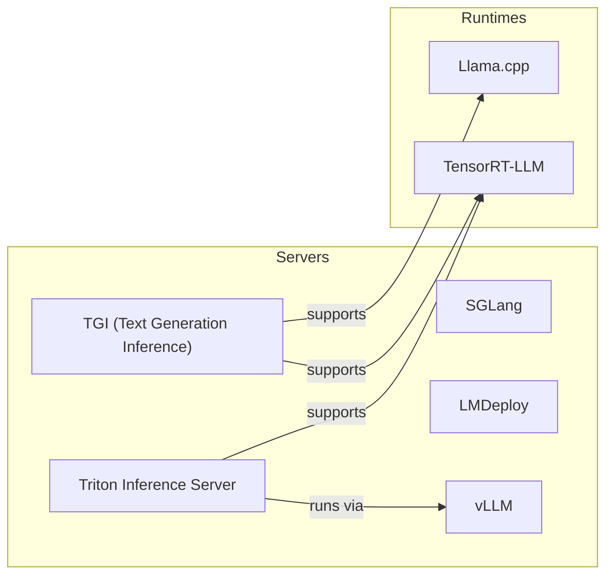

# Productizing DeepSeek


Productizing DeepSeek is an open-source project code for https://lu.ma/noj3yy63 webinar.


## Table of Contents

- [Setup](#setup)
- [Tree of Models](#tree-of-models)
- [Managed](#managed)
- [Clouds: AWS & Azure](#clouds-aws--azure)
- [DIY](#diy)
- [Future Improvements](#future-improvements)


## Setup


```
uv sync --frozen --no-cache
uv run modal setup
```

## Tree of Models




## Managed 


### Local

https://ollama.com/download/mac

```bash
ollama run deepseek-r1:1.5b
```

### Serverless

| Platform         | R1 Support | R1 Distilled Support | Price per 1M Tokens (Input/Output) | OpenAI Compatible |
| ---------------- | ---------- | -------------------- | ---------------------------------- | ----------------- |
| Deepseek         | Yes        | No                   | $0.55 / $2.19                     | Yes               |
| Hyperbolic       | Yes        | No                   | $2.00 / $2.00                     | Yes               |
| Nebius AI Studio | Yes        | Yes                  | $0.80 / $2.40                     | Yes               |
| Fireworks        | Yes        | Yes                  | $3.00 / $8.00                     | Yes               |
| Novita           | Yes        | Yes                  | $4.00 / $4.00                     | Yes               |
| Together AI      | Yes        | Yes                  | $7.00 / $7.00                     | Yes               |

** As of Feb 19, 2025


```bash
uv run ./src/productizing_deepseek/clients.py groq 'Write some python code'
uv run ./src/productizing_deepseek/clients.py together 'Write some python code'
```


## Clouds 

### AWS: reservation for ml.p5e.48xlarge: $41.6116 per hour

### Azure: servelsss and free (as of now)

```
uv run ./src/productizing_deepseek/clients.py azure 'Write some python code'
```


## DIY





https://github.com/deepseek-ai/DeepSeek-V3?tab=readme-ov-file#6-how-to-run-locally

SGLang: https://github.com/sgl-project/sglang/tree/main/benchmark/deepseek_v3
LMDeploy: https://github.com/InternLM/lmdeploy/issues/2960
TRT-LLM: https://github.com/NVIDIA/TensorRT-LLM/tree/deepseek/examples/deepseek_v3
vLLM: https://github.com/vllm-project/vllm/issues/11539


## vLLM + Modal 

### Pricing

| GPU Model | vRAM | Memory Type | Price/Hour |
|-----------|------|-------------|------------|
| Nvidia H200 | 141 GB | HBM3e | ? |
| Nvidia H100 | 80 GB | HBM3 | $4.56 |
| Nvidia A100 | 80 GB | HBM2e | $3.40 |
| Nvidia A100 | 40 GB | HBM2 | $2.78 |
| Nvidia L40S | 48 GB | GDDR6 | $1.95 |
| Nvidia A10G | 24 GB | GDDR6 | $1.10 |
| Nvidia L4 | 24 GB | GDDR6 | $0.80 |
| Nvidia T4 | 16 GB | GDDR6 | $0.59 |


### Estimate

| Model | Parameters | Min vRAM Required | Suitable GPUs |
|-------|------------|-------------------|---------------|
| DeepSeek-R1 | 685B | ~1,370 GB | Not possible on single GPU - needs multi-node |
| DeepSeek-R1-Distill-Llama-70B | 70B | ~140 GB | H200 only |
| DeepSeek-R1-Distill-Qwen-32B | 32B | ~64 GB | H200, H100, A100-80GB |
| DeepSeek-R1-Distill-Qwen-14B | 14B | ~28 GB | All except T4 |
| DeepSeek-R1-Distill-Llama-8B | 8B | ~16 GB | All GPUs |
| DeepSeek-R1-Distill-Qwen-7B | 7B | ~14 GB | All GPUs |
| DeepSeek-R1-Distill-Qwen-1.5B | 1.5B | ~3 GB | All GPUs |

### Try!

1. create project  

```bash
uv run modal environment create productizing-deepseek
```

2. download models

```bash
uv run modal run --detach  src/productizing_deepseek/custom_load.py --model-name deepseek-ai/DeepSeek-R1
uv run modal run --detach  src/productizing_deepseek/custom_load.py --model-name deepseek-ai/DeepSeek-R1-Distill-Llama-70B
uv run modal run --detach  src/productizing_deepseek/custom_load.py --model-name deepseek-ai/DeepSeek-R1-Distill-Qwen-32B
uv run modal run --detach  src/productizing_deepseek/custom_load.py --model-name deepseek-ai/DeepSeek-R1-Distill-Qwen-14B
uv run modal run --detach  src/productizing_deepseek/custom_load.py --model-name deepseek-ai/DeepSeek-R1-Distill-Llama-8B
uv run modal run --detach  src/productizing_deepseek/custom_load.py --model-name deepseek-ai/DeepSeek-R1-Distill-Qwen-7B
uv run modal run --detach  src/productizing_deepseek/custom_load.py --model-name deepseek-ai/DeepSeek-R1-Distill-Qwen-1.5B
```

```bash
uv run modal run --detach  src/productizing_deepseek/custom_load.py --model-name perplexity-ai/r1-1776
uv run modal run --detach  src/productizing_deepseek/custom_load.py --model-name unsloth/DeepSeek-R1
uv run modal run --detach  src/productizing_deepseek/custom_load.py --model-name unsloth/DeepSeek-R1-GGUF
uv run modal run --detach  src/productizing_deepseek/custom_load.py --model-name unsloth/DeepSeek-R1-Distill-Qwen-1.5B-GGUF
```

```bash
uv run modal shell --volume productizing-deepseek
```


3. create deployments

```bash
uv run modal deploy src/productizing_deepseek/custom_vllm_llama_1b.py
uv run modal deploy src/productizing_deepseek/custom_vllm_llama_8b.py
uv run modal deploy src/productizing_deepseek/custom_vllm_qwen_32b.py
uv run modal deploy src/productizing_deepseek/custom_vllm_llama_70b.py
uv run modal deploy src/productizing_deepseek/custom_vllm_r1.py
```

4. clients

```bash
uv run python ./src/productizing_deepseek/clients.py modal 'test' "DeepSeek-R1-Distill-Qwen-1.5B" "https://truskovskiyk-productizing-deepseek--distill-llama-1b-serve.modal.run/v1"
uv run python ./src/productizing_deepseek/clients.py modal 'test' "DeepSeek-R1-Distill-Llama-8B" "https://truskovskiyk-productizing-deepseek--distill-llama-8b-serve.modal.run/v1/"
uv run python ./src/productizing_deepseek/clients.py modal 'test' "DeepSeek-R1-Distill-Qwen-32B" "https://truskovskiyk-productizing-deepseek--distill-qwen-32b-serve.modal.run/v1/"
uv run python ./src/productizing_deepseek/clients.py modal 'test' "DeepSeek-R1-Distill-Llama-70B" "https://truskovskiyk-productizing-deepseek--distill-llama-70b-serve.modal.run/v1/"
uv run python ./src/productizing_deepseek/clients.py modal 'test' "DeepSeek-R1" "https://truskovskiyk-productizing-deepseek--r1-serve.modal.run/v1/"
```


5. clean up 

```bash
modal app stop --name r1
modal app stop --name distill-llama-70b 
modal app stop --name distill-qwen-32b 
modal app stop --name distill-llama-8b
```

### Results

| Model               | GPU Type              | Number of GPUs | Price per GPU (per hour) | Total Cost (per hour) | GPU meme req | Start time |
|---------------------|-----------------------|----------------|--------------------------|-----------------------|--------------|------------|
| distill-llama-1.5b    | Nvidia A10 (24 GB)   | 1              | $1.10                    | $1.10                | 19GB         | 1.10     |
| distill-llama-8b    | Nvidia A100 (40 GB)   | 1              | $2.78                    | $2.78                | 35GB         | 51.84s     |
| distill-llama-70b   | Nvidia A100 (80 GB)   | 2              | $3.40                    | $6.80                | 71GB         | 1m12s      |
| distill-qwen-32b    | Nvidia A100 (80 GB)   | 1              | $3.40                    | $3.40                | 143GB        | 2m16s      |
| r1                  | Nvidia H200 (141 GB)  | 8              | $4.56                    | $36.48               | 1003GB       | 19m58s     |
